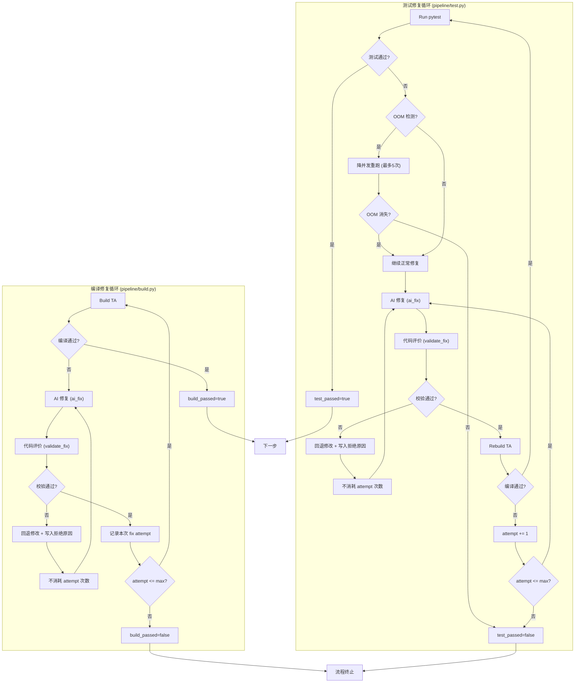
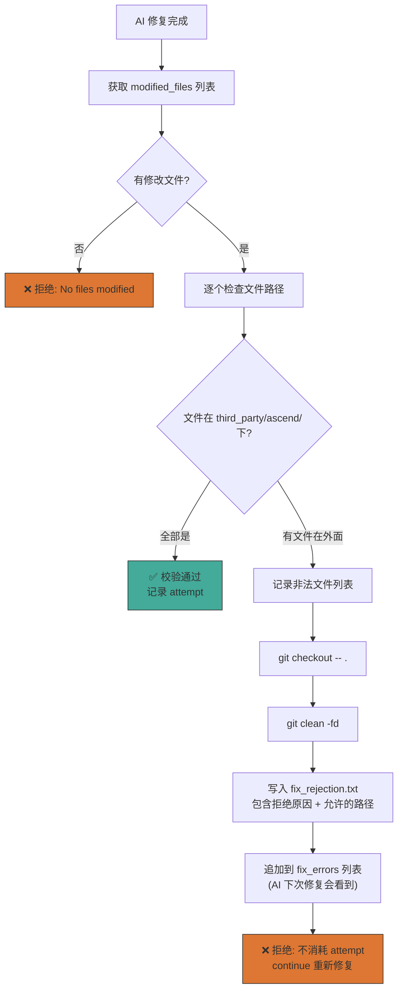
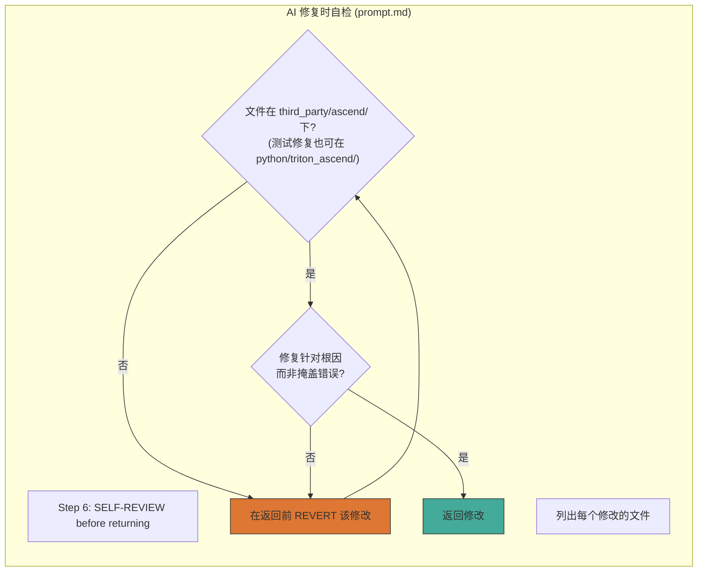

# 编译与测试修复代码的评价和测试机制

## 总体流程

## 代码评价机制 (validate_fix)

## AI 自检机制 (prompt.md step 6)

## 双层防护总结

| 层级 | 位置 | 机制 | 失败处理 |
|------|------|------|----------|
| **第1层** | AI 自检 (prompt.md) | AI 提交前自查文件路径 + 根因 | 自行回退后重新修复 |
| **第2层** | 代码校验 (fix.py) | 硬检查 modified_files 路径 | git revert + 反馈文件 + 不消耗 attempt |
| **第3层** | 编译/测试验证 | 实际 build/test 结果 | 编译/测试失败 → 继续 fix loop |

## 关键设计决策

1. **拒绝不消耗 attempt**：修复被拒后 `continue` 在同一 attempt 重新修复（while 循环），确保 AI 有完整的 max_retries 次有效尝试
2. **拒绝后回退代码**：`git checkout -- .` + `git clean -fd` 清除所有修改，下一轮从干净状态开始
3. **拒绝反馈传递给 AI**：`fix_rejection.txt` 追加到 `fix_errors` 列表，AI 下次修复时在 error_logs 中看到
4. **OOM 单独处理**：OOM 不调用 AI，自动降并发重跑（test_procs 减半），与代码修复完全独立
