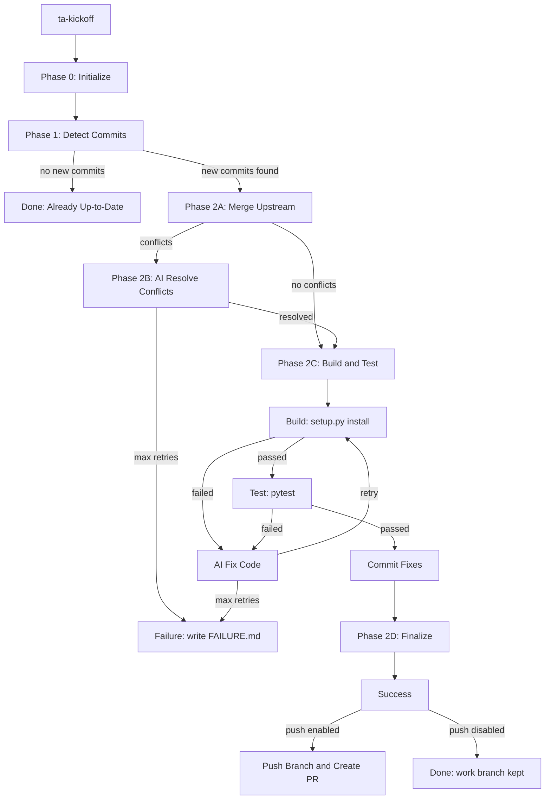

# TA Main2Main Auto-Sync — 工作流完整指南

## 概述

TA_main2main_workflow 是一个自动化流水线，用于将上游 Triton 的更新同步到
triton-ascend（Triton 的 Ascend NPU 适配版）。它基于 CrewAI Flow 框架，通过
git merge + AI 辅助的方式，自动完成从检测更新、合并代码、解决冲突、编译构建、
运行测试到提交 PR 的全流程。

### 核心思路

triton-ascend 是 Triton 的 **fork**。上游 Triton 的 `main` 分支每次推进，
triton-ascend 都需要跟上。但 triton-ascend 中包含大量 Ascend NPU 的适配代码
（新增文件 和 对上游文件的修改），简单的 `git merge` 经常会产生冲突，合并后
也可能出现编译错误或测试失败。

本工作流通过 **AI + 确定性脚本** 的组合来系统化地解决这个问题：
确定性脚本负责 git 操作、编译、测试等可重复操作，AI 负责解决冲突和修复测试失败。

### 渐进式步骤合并（Progressive Step Merge）

当上游 Triton 的 `main` 分支有较多 commit 推进时（例如 50+ 个 commit），
一次性 `git merge` 全部变更会带来几个问题：

1. **冲突范围过大**：大量变更同时合并，冲突文件多，AI 解决冲突的难度指数级上升
2. **修复定位困难**：编译或测试失败时，很难确定是哪个上游 commit 引入的问题
3. **回滚成本高**：合并到一半失败，所有工作丢失，需要从头再来

为解决这些问题，TA_main2main_workflow 引入了 **渐进式步骤合并**
（Progressive Step Merge）机制，自动将上游 commit 按代码变更量切分为多个
"步骤"（step），每个步骤分别合并、验证、修复。这参考了
[vllm-ascend 的 main2main_flow](https://github.com/triton-lang/triton-ascend)
中的 `plan_steps` 设计。

#### 切分算法（plan_steps）

`scripts/plan_steps.py` 中的确定性算法：

1. **列出所有 upstream commit**：`git log --reverse merge_base..target_commit`
2. **逐 commit 统计源码行变更**：对每个 commit 运行 `git diff-tree --numstat`，
   只统计关键源码目录（`python/triton/`、`lib/`、`include/`）的增删行数
3. **跳过无关 commit**：不涉及源码目录的 commit（如 CI 配置、文档修改）会被跳过，
   不占用步骤配额
4. **按预算累积分组**：
   - **行数预算**（`TA_LINE_BUDGET`）：默认 1000 行。一个步骤内所有 commit
     的源码变更行数之和不超过此值
   - **commit 数预算**（`commit_count_budget`）：由公式 `max(1, round(TA_COMMIT_BUDGET * sqrt(TA_LINE_BUDGET / 1000)))` 计算。
     默认 TA_COMMIT_BUDGET=5、TA_LINE_BUDGET=1000 → 每步最多 **5 个 commit**
   - commit 逐个累积，直到超过任一预算，则当前步骤结束，开始新步骤
5. **超大 commit 单独成步**：单个 commit 的源码变更超过行数预算时，
   该 commit 独占一个步骤

#### 渐进式合并流程

在 progressive mode 下（默认开启），每个步骤的合并流程：

```
Step 1: git merge step-1.end_commit → resolve conflicts → build → test → fix → commit
Step 2: git merge step-2.end_commit → resolve conflicts → build → test → fix → commit
Step 3: git merge step-3.end_commit → resolve conflicts → build → test → fix → commit
...
Final: 生成累积 patch 和 summary → 切回原始分支
```

关键设计点：
- 第一个步骤会从 `triton-lang/triton-ascend` 的 `main` 分支创建新的 work branch
- 后续步骤在同一个 work branch 上累积合并（使用 `git merge --no-ff`）
- 每个步骤成功后自动 `git commit`，失败时保留 work branch 的中间状态
- 最终生成的 `final_target.patch` 是**所有步骤的累积 diff**

#### 控制开关

| 环境变量 | 说明 | 默认值 |
|---------|------|--------|
| `TA_PROGRESSIVE_MERGE` | 是否启用渐进式步骤合并 | `true` |
| `TA_LINE_BUDGET` | 每步骤最大源码变更行数 | `1000` |

```bash
# 关闭渐进式合并，使用传统的单步合并（一次性合并全部 commit）
TA_PROGRESSIVE_MERGE=false ta-kickoff ...

# 调整每步骤的行数预算（越大每步包含的 commit 越多，执行时间越长）
TA_LINE_BUDGET=2000 ta-kickoff ...

# 更细粒度控制（每步最多 500 行变更）
TA_LINE_BUDGET=500 ta-kickoff ...

# 控制 commit 数粒度（每步最多 ~3 个 commit，生成更多步骤）
TA_COMMIT_BUDGET=3 ta-kickoff ...

# 更粗粒度（每步最多 ~10 个 commit）
TA_COMMIT_BUDGET=10 ta-kickoff ...
```

---

## 工作流示意图

### Mermaid 流程图



### ASCII 文本流程图

```
┌──────────────────────────────────────────────────────────────────────────────┐
│                        TA Main2Main Auto-Sync Flow                           │
└──────────────────────────────────────────────────────────────────────────────┘

                              ┌──────────────┐
                              │   START      │
                              │ (ta-kickoff) │
                              └──────┬───────┘
                                     │
                                     ▼
                    ┌────────────────────────────────┐
                    │  Phase 0: initialize           │
                    │  ──────────────────────────    │
                    │  • 清空 workspace/             │
                    │  • 读取 CLI / 环境变量配置      │
                    │  • 记录当前分支和 HEAD          │
                    │  • 中止残留的 git merge         │
                    └────────────────┬───────────────┘
                                     │
                                     ▼
                    ┌────────────────────────────────┐
                    │  Phase 1: detect_commits       │
                    │  ──────────────────────────    │
                    │  • fetch upstream-triton       │
                    │  • 找到 merge-base              │
                    │  • 列出待合并的 upstream commit │
                    │  • 统计改动文件数和行数           │
                    └────────────────┬───────────────┘
                                     │
                          ┌──────────┴──────────┐
                          │  有新 commit 吗？    │
                          └──────────┬──────────┘
                               Yes    │    No
                    ┌─────────────────┘    └──────────────┐
                    ▼                                     ▼
    ┌──────────────────────────────┐      ┌──────────────────────────────┐
    │ Phase 2: execute_sync       │      │  Already Up-to-Date          │
    │ (单节点编排，内部4步)         │      │  无需同步，直接结束            │
    └──────────────┬───────────────┘      └──────────────────────────────┘
                   │
    ┌──────────────┴─────────────────────────────────────────────────────┐
    │                                                                     │
    ▼                                                                     │
┌─────────────────────────────────────────────┐                          │
│ Step 2A: _do_merge                           │                          │
│ ───────────────────────────                  │                          │
│ • 从 triton-lang/triton-ascend 的             │                          │
│   最新 main 创建 work branch                  │                          │
│ • git fetch upstream-triton                  │                          │
│ • git merge <target_commit>                  │                          │
│ • 记录冲突文件（如有）                          │                          │
└──────────────┬──────────────────────────────┘                          │
               │                                                         │
               ▼                                                         │
        ┌──────┴──────┐                                                 │
        │ 有冲突吗？    │                                                 │
        └──────┬──────┘                                                 │
          Yes  │  No                                                     │
    ┌──────────┘    └───────────┐                                       │
    ▼                           ▼  (直接跳到 Step 2C)                    │
┌─────────────────────────────────────────────┐                          │
│ Step 2B: _do_resolve_conflicts               │                          │
│ ──────────────────────────────               │                          │
│ • AI (opencode/claude) 读取冲突文件          │                          │
│ • AI 分析并解决冲突                          │                          │
│ • 最多重试 3 次                              │                          │
│ • 解决后 git add -u && git commit           │                          │
│ • 运行 pre-CI 检查（残留标记/语法等）         │                          │
└──────────────┬──────────────────────────────┘                          │
               │ (冲突解决成功或本来就没有冲突)                              │
               ▼                                                         │
┌─────────────────────────────────────────────┐                          │
│ Step 2C: _do_build_and_fix_loop              │                          │
│ ───────────────────────────────              │                          │
│                                               │                          │
│  ┌─────────────────────────────────────┐     │                          │
│  │         ATTEMPT LOOP                │     │                          │
│  │  (最多 max_retries=3 轮)            │     │                          │
│  │                                     │     │                          │
│  │  ┌─► build_triton_ascend()         │     │                          │
│  │  │   python3 setup.py install       │     │                          │
│  │  │   (带 Ascend 编译环境变量)         │     │                          │
│  │  │                                 │     │                          │
│  │  │   Build 失败? ──Yes──► AI fix ──┘     │                          │
│  │  │        │                              │                          │
│  │  │       No                              │                          │
│  │  │        ▼                              │                          │
│  │  │   run_tests()                        │                          │
│  │  │   pytest -n 16 unittest/pytest_ut    │                          │
│  │  │                                      │                          │
│  │  │   Test 全部通过? ──Yes──► 跳出循环     │                          │
│  │  │        │                              │                          │
│  │  │        │   有 NPU OOM?                │                          │
│  │  │        │    (重跑全部)                 │                          │
│  │  │        │                              │                          │
│  │  │       No (有失败)                     │                          │
│  │  │        │                              │                          │
│  │  └── AI fix ◄────────────────────────────┘                          │
│  │      (opencode fix 模式)                                             │
│  └─────────────────────────────────────┘                               │
│                                                                         │
│  所有测试通过 ▼                                                         │
│  _commit_fixes()                                                        │
│  git add -u && git commit                                               │
└──────────────┬──────────────────────────────────────────────┐          │
               │                                              │          │
               ▼                                              │          │
┌─────────────────────────────────────────────┐              │          │
│ Step 2D: _do_finalize                       │              │          │
│ ──────────────────────                       │              │          │
│ • 生成 final_summary.md                     │              │          │
│ • 生成 cumulative patch (final_target.patch)│              │          │
│ • 切回原始分支 (git checkout original)      │              │          │
│ • 保留 work branch 供检查                    │              │          │
└─────────────────────────────────────────────┘              │          │
│                                                            │          │
└────────────────────────────────────────────────────────────┘          │
                                                                         │
    ┌────────────────────────────────────────────────────────┐          │
    │         execute_sync 返回 UpgradeCompleted 或             │          │
    │         UpgradeFailed                                   │          │
    └────────────┬──────────────────────┬─────────────────────┘          │
                 │                      │
          Completed               Failed
                 │                      │
                 ▼                      ▼
    ┌──────────────────────┐  ┌──────────────────────┐
    │ push_to_github       │  │ handle_failure       │
    │ ────────────────     │  │ ──────────────       │
    │ (PUSH_TO_GITHUB=true │  │ • 写 FAILURE.md      │
    │  时才触发)            │  │ • 打印诊断信息        │
    │                       │  │ • 保留 work branch   │
    │ • git add -u          │  │   供手动排查           │
    │ • git commit          │  │                      │
    │ • git push origin     │  └──────────────────────┘
    │ • gh pr create        │
    └──────────────────────┘
                 │
                 ▼
         ┌──────────────┐
         │   DONE       │
         │  PR URL or    │
         │  FAILURE.md   │
         └──────────────┘
```

---

## 前置条件

### 必需环境

| 依赖 | 说明 |
|------|------|
| Python 3.10–3.13 | 运行工作流本身 |
| git | 所有版本控制操作 |
| `triton` 仓库 | 上游 Triton 的本地 clone |
| `triton-ascend` 仓库 | triton-ascend 的本地 clone（Ascend 适配版） |

### AI 后端（二选一）

| 后端 | 安装方式 |
|------|---------|
| **opencode**（推荐） | 安装 [`opencode`](https://opencode.ai) CLI，确保在 `$PATH` 中 |
| **claude** | 安装 `claude` CLI (`npm install -g @anthropic-ai/claude`) |

### 构建环境

- **LLVM**：设置 `LLVM_INSTALL_PREFIX` 指向 LLVM 安装目录
- **Ascend NPU**（可选）：测试需要 Ascend 硬件；可设置 `SKIP_E2E_TEST=true` 跳过
- **Conda**（推荐）：默认使用 `ta-upgrade` 环境

### PR 创建（可选）

- [GitHub CLI](https://cli.github.com/) (`gh`) 已登录认证
- 设置 `PUSH_TO_GITHUB=true` 和 `GITHUB_REPO=triton-lang/triton-ascend`

---

## 安装与运行

### 安装

```bash
cd TA_main2main_workflow
pip install -e .
```

安装后可使用两个命令：`ta-kickoff`（执行同步）和 `ta-plot`（生成流程图）。

### 基本用法

```bash
# 最简单的用法 — 两个 repo 都在当前目录
ta-kickoff --triton-ascend-path ./triton-ascend --triton-path ./triton

# 指定要同步到的上游 commit
ta-kickoff \
  --triton-ascend-path ./triton-ascend \
  --triton-path ./triton \
  --target-commit abc123def456789...

# Dry-run：只走流程不调 AI、不跑测试
SKIP_AI_ANALYSIS=true SKIP_E2E_TEST=true SKIP_BUILD=true \
ta-kickoff --triton-ascend-path ./triton-ascend --triton-path ./triton
```

---

## 各阶段详解

### Phase 0 — Initialize（初始化）

这是每次运行的起点，执行以下操作：

1. **清空 workspace**：删除上一轮的 `workspace/` 目录，重新创建
2. **读取配置**：按优先级 CLI args → 环境变量 → 默认值 读取路径和参数
3. **记录原始状态**：保存当前 git 分支名和 HEAD commit，流程结束后会切回来
4. **清理残留状态**：如果上次运行异常中断留下了 `MERGE_HEAD`，自动 `git merge --abort`

### Phase 1 — Detect Commits（检测更新）

确定需要同步的 upstream commit 范围：

1. Fetch `upstream-triton` 远程的最新引用
2. 计算 `merge-base`（triton-ascend 与 upstream 的共同祖先）
3. 列出 `merge-base..target_commit` 之间所有 upstream commit
4. 统计改动范围（文件数、行数、各目录的改动量）

**输出文件**：`workspace/detect.json`

如果 `merge-base == target_commit`（没有新 commit），流程直接结束，返回 "已是最新"。

当检测到新 commit 且 `TA_PROGRESSIVE_MERGE=true`（默认）时，
Phase 1 还会自动执行 **步骤规划**（Step Planning）：

1. 逐 commit 统计每个 upstream commit 在关键源码目录中的变更行数
2. 按行数预算（`TA_LINE_BUDGET`，默认 1000 行）和 commit 数预算切分为多个步骤
3. 不涉及源码的 commit 会被跳过（如文档、CI 配置修改）
4. 生成 `workspace/steps.json` 和每个步骤的 patch/commit 列表

### Phase 2 — Execute Steps（步骤执行）

> **渐进式模式**（`TA_PROGRESSIVE_MERGE=true`，默认）：对每个规划的步骤执行完整的
> 合并→解决冲突→编译→测试→修复→提交 流程，前一步成功后才进入下一步。
> 
> **单步模式**（`TA_PROGRESSIVE_MERGE=false`）：一次性合并所有 upstream commit，
> 与渐进式模式使用完全相同的内部方法。

每个步骤（或单步模式下的全局）执行以下子阶段：

#### Phase 2A — Merge Upstream（合并上游）

将当前步骤的 upstream 变更合入 triton-ascend：

1. **创建工作分支**（仅第一步）：
   - 确保 triton-ascend 仓库有指向 `https://github.com/triton-lang/triton-ascend.git` 的 remote
   - `git fetch <remote> main` 拉取最新的 main
   - `git checkout -B auto/upstream-sync-<timestamp> <remote>/main` 基于最新 main 创建分支

2. **合并步骤目标 commit**：
   - Fetch upstream-triton 的最新数据
   - `git merge --no-ff --no-edit <step.end_commit>`
   - 后续步骤在上一步的 work branch 上继续 merge（累积合并）

3. **记录结果**：
   - 如果有冲突，保存每个冲突文件的完整内容到 `workspace/conflicts/`
   - 输出 merge 日志到 `workspace/merge.log`

**输出文件**：`workspace/merge_result.json`、`workspace/merge.log`、`workspace/conflicts/`

#### Phase 2B — Resolve Conflicts（AI 解决冲突）

> 仅当合并产生冲突时执行。无冲突则跳过。

1. **AI 分析冲突**：将冲突文件快照传递给 AI（opencode/claude），AI 在 `conflict` 模式下分析并解决
2. **最多重试 3 次**：每次 AI 尝试后检查是否还有残留冲突标记
3. **提交解决结果**：`git add -u && git commit -s`
4. **Pre-CI 检查**：扫描是否还有冲突标记、临时文件、语法错误

AI 参考 `reference/` 目录下的知识库文件来理解 triton-ascend 的代码结构、常见错误模式和适配策略。

**注意**：`git add -u` 只 stage 已跟踪文件的修改，不会把测试过程中产生的临时文件、缓存、日志等误提交。

#### Phase 2C — Build & Fix Loop（编译→测试→修复循环）

这是核心循环，最多执行 `max_retries+1`（默认 4 次 = 首轮 + 3 轮修复）：

```
Round 0: build → test        (首次尝试，不做修复)
Round 1: AI fix → build → test
Round 2: AI fix → build → test
Round 3: AI fix → build → test  (最后一次)
```

#### 编译步骤

```bash
# 在 triton-ascend 目录下，带 Ascend 编译环境变量
LLVM_SYSPATH=$LLVM_INSTALL_PREFIX \
TRITON_BUILD_WITH_CCACHE=true \
TRITON_BUILD_WITH_CLANG_LLD=true \
TRITON_BUILD_PROTON=OFF \
DEBUG=1 \
TRITON_WHEEL_NAME="triton-ascend" \
TRITON_APPEND_CMAKE_ARGS="-DTRITON_BUILD_UT=OFF" \
python3 setup.py install
```

编译成功后会清理 `~/.triton/cache/`。

#### 测试步骤

```bash
pytest -n 16 third_party/ascend/unittest/pytest_ut/
```

#### AI 修复

当编译或测试失败时，AI 以 `fix` 模式运行：
- 读取错误日志（`build_result.json` 或 `test_result.json`）
- 分析失败原因并修改 triton-ascend 源码
- 修改后运行 pre-CI 检查

#### NPU OOM 特殊处理

如果测试日志中出现 NPU OOM（`npu.OutOfMemoryError`、`device memory allocation failed` 等），
**不修改代码**，而是重跑全部测试用例。OOM 是瞬时的资源分配问题，非代码缺陷。
详见 `reference/npu-oom-handling.md`。

#### 修复提交

当所有测试通过后，自动提交修复：

```bash
git add -u
git commit -s -m "fix: <AI生成的修复摘要>

Upstream target: <commit_sha>
Fix attempt: <尝试次数>
Work branch: <分支名>"
```

#### Phase 2D — Commit Step（提交步骤进度）

每个步骤通过测试后，自动提交该步骤的进度：

```bash
git add -u
git commit -s -m "sync: merge upstream commits for step <step-N>
...
Upstream range: <start>..<end>
Step: N/M
Commits in step: <N>"
```

#### Phase 2E — Finalize（收尾）

1. **生成产物**：
   - `workspace/final_summary.md` — 最终同步摘要（渐进式模式下合并所有步骤的摘要）
   - `workspace/final_target.patch` — 本次同步的**完整累积 diff**（从原始 ascend HEAD 到最新 work branch HEAD）

2. **恢复分支**：`git checkout <original_branch>` 切回同步前的分支
   - work branch 保留不删，方便手动检查

3. **打印汇总表**：所有阶段（含每个步骤）的通过/失败/跳过状态一览

### Terminal — Push to GitHub / Handle Failure

#### 成功 → Push to GitHub

**渐进式模式**（默认，`TA_PROGRESSIVE_MERGE=true`）：

每个步骤完成后，当 `PUSH_TO_GITHUB=true` 时：

1. 认证 GitHub CLI
2. `git push -u origin <work_branch>` 推送当前 work branch
3. **第一步**：`gh pr create` 创建 PR（标题含步骤编号，如 `[Step 1/3] sync: upstream triton merge`）
4. **后续步骤**：直接 push 到同一分支，PR 自动更新
5. 全部步骤完成后，更新 PR 描述：列出所有已完成步骤的摘要

**单步模式**（`TA_PROGRESSIVE_MERGE=false`）：

1. 认证 GitHub CLI
2. `git add -u && git commit -s`（提交最终变更）
3. `git push -u origin <work_branch>`
4. `gh pr create` 创建 PR，base 指向仓库默认分支

#### 失败 → Handle Failure

1. 写 `workspace/FAILURE.md` 包含完整诊断信息
2. 打印恢复命令（如何切回原始分支、如何删除失败的 work branch）
3. work branch 保留供手动排查

---

## 环境变量完整参考

| 变量 | 用途 | 默认值 | 生效阶段 |
|------|------|--------|---------|
| `TRITON_ASCEND_PATH` | triton-ascend 仓库路径 | 当前目录 | Initialize |
| `TRITON_PATH` | 上游 triton 仓库路径 | 当前目录 | Initialize |
| `TRITON_TARGET_COMMIT` | 目标 upstream commit | triton HEAD | Detect |
| `AI_BACKEND` | AI 后端：`opencode` 或 `claude` | 自动检测 | Resolve / Fix |
| `SKIP_AI_ANALYSIS` | 跳过所有 AI 调用 | `false` | Resolve / Fix |
| `SKIP_BUILD` | 跳过编译 | `false` | Build |
| `SKIP_E2E_TEST` | 跳过测试 | `false` | Test |
| `PUSH_TO_GITHUB` | 成功后创建 PR（渐进式模式下每步都推） | `false` | Push |
| `GITHUB_REPO` | PR 目标仓库 `owner/name` | `TecJesh/triton-ascend` | Push |
| `LLVM_INSTALL_PREFIX` | LLVM 安装路径 | — | Build |
| `CONDA_ENV` | Conda 环境名称 | `ta-upgrade` | Build / Test |
| `NUM_PROCS` | pytest 并行 worker 数 | `16` | Test |
| `AUTO_STASH` | 创建 work branch 前自动 stash | `false` | Merge |
| `TA_PROGRESSIVE_MERGE` | 启用渐进式步骤合并 | `true` | Detect / Plan |
| `TA_LINE_BUDGET` | 每步骤最大源码变更行数 | `1000` | Plan |
| `TA_COMMIT_BUDGET` | commit 数预算基数（越小步骤越细） | `5` | Plan |

> **步骤切分策略**：plan_steps 按**行数预算**和 **commit 数预算**两个维度同时切分，
> 任一维度超限即开始新步骤。commit 数预算 = `max(1, round(TA_COMMIT_BUDGET * sqrt(TA_LINE_BUDGET / 1000)))`。
> 默认 TA_COMMIT_BUDGET=5、TA_LINE_BUDGET=1000 → 每步最多 5 个 commit。
> 
> 如果觉得步骤太粗（commit 太多合在一步），减小 `TA_COMMIT_BUDGET`（如 3）。
> 如果觉得步骤太细，增大 `TA_COMMIT_BUDGET`（如 10）。

---

## 输出文件结构

```
workspace/
├── detect.json                 # 检测结果：merge-base、target、commit 列表
├── steps.json                  # 步骤规划：每个步骤的 commit 范围、行数统计
├── merge_result.json           # 合并结果：分支名、冲突状态
├── merge.log                   # git merge 原始输出
├── build_result.json           # 编译结果：各步骤通过/失败
├── build.log                   # 编译原始输出
├── test_result.json            # 测试结果：通过/失败计数
├── test-logs/
│   ├── pytest.log              # pytest 原始输出
│   └── precommit.log           # pre-commit 检查输出
├── conflicts/                  # 冲突文件快照（如有）
│   └── <path>_<filename>.conflict
├── fixes/
│   └── fix-<N>/                # 每轮修复的日志
│       └── opencode.log
├── steps/                      # 渐进式合并的每步产物
│   └── step-<N>/
│       ├── commits.txt         # 该步骤包含的 commit 列表
│       ├── upstream.patch      # 该步骤对应的上游 diff
│       ├── changed_files.txt   # 该步骤改动的文件列表
│       ├── step_summary.md     # AI 生成的步骤摘要
│       ├── step_target.patch   # 该步骤适配后的 diff
│       ├── analysis.md         # 修复诊断
│       ├── review.md           # 修复自查
│       └── opencode.log        # AI 调用日志
├── step-0/                     # 单步模式（TA_PROGRESSIVE_MERGE=false）产物
│   ├── step_summary.md
│   ├── step_target.patch
│   ├── analysis.md
│   ├── review.md
│   └── opencode.log
├── final_summary.md            # 最终同步摘要
├── final_target.patch          # 完整 diff（累积所有步骤，用于 PR）
├── FAILURE.md                  # 失败诊断（仅失败时）
└── sync_meta.json              # 同步元数据
```

> **注意**：渐进式模式下产物写入 `workspace/steps/step-<N>/`；单步模式下
> 产物写入 `workspace/step-0/`（向后兼容）。

---

## 常见场景

### 场景 1：无冲突同步

```
merge → (无冲突) → build → test → all pass → finalize → DONE
```

最简单的情况。AI 只用于可能需要的修复，冲突解决直接跳过。

### 场景 2：有冲突但无代码错误

```
merge → conflict → AI resolve(1次成功) → build → test → all pass → finalize → DONE
```

AI 解决了冲突，代码编译和测试都直接通过。

### 场景 3：需要多轮修复

```
merge → conflict → AI resolve(2次) → build pass → test fail
       → AI fix(Round 1) → build pass → test fail
       → AI fix(Round 2) → build pass → test all pass
       → commit fixes → finalize → DONE
```

### 场景 4：修复耗尽，同步失败

```
merge → AI resolve → build pass → test fail
       → AI fix(R1) → test fail
       → AI fix(R2) → test fail
       → AI fix(R3) → test fail
       → max_retries exhausted → UpgradeFailed → FAILURE.md
```

work branch 保留，可以手动 `git checkout auto/upstream-sync-...` 继续排查。

### 场景 5：渐进式多步骤合并（默认模式）

上游有 45 个 commit（其中 30 个涉及源码，共约 2800 行变更），
自动切分为 3 个步骤：

```
detect(45 commits, 2800 lines) → plan(3 steps)
  → Step 1(12 commits, 950 lines): merge → (clean) → build → test → pass → commit
  → Step 2(10 commits, 980 lines): merge → conflict → AI resolve → build → test → pass → commit  
  → Step 3(8 commits, 870 lines):  merge → (clean) → build → test fail
         → AI fix(R1) → build → test pass → commit
  → finalize: 生成累积 patch(2800+ lines) + summary → DONE
```

每个步骤只处理约 1000 行以内的变更，冲突范围可控、修复定位精确。
即使某一步失败，前几步的进度已提交，不会全部丢失。

### 场景 6：Dry-run 调试

```bash
SKIP_AI_ANALYSIS=true SKIP_BUILD=true SKIP_E2E_TEST=true \
ta-kickoff --triton-ascend-path ... --triton-path ...
```

跳过 AI 和编译测试，只走 git merge 流程。适合验证工作流本身是否正常。

---

## 故障排查

### work branch 创建失败

```
[merge] ERROR: Working tree has uncommitted changes
```

**原因**：triton-ascend 仓库有未提交的修改。

**解决**：
- 手动 `git stash` 暂存修改
- 或设置 `AUTO_STASH=true` 让工作流自动 stash

### AI 后端不可用

```
AI backend not available
```

**原因**：`opencode` 或 `claude` 不在 `$PATH` 中。

**解决**：
- 安装 opencode：参考 https://opencode.ai
- 或设置 `AI_BACKEND=claude` 使用 claude CLI
- 或设置 `SKIP_AI_ANALYSIS=true` 跳过 AI（需要手动解决冲突和修复）

### 编译失败

检查 `workspace/build.log` 中的错误。常见原因：
- `LLVM_INSTALL_PREFIX` 未设置或指向错误路径
- Conda 环境未激活或缺少依赖

### 测试持续 OOM

1. 查看 `workspace/test-logs/pytest.log` 确认是 NPU OOM
2. 减少并行度：`NUM_PROCS=8 ta-kickoff ...`
3. OOM 是瞬时资源问题，多次重跑通常会消失
4. 参考 `reference/npu-oom-handling.md`

### PR 创建失败

- 确认 `gh auth status` 显示已登录
- 确认 `GITHUB_REPO` 格式正确（`owner/name`，不含 `https://`）

---

## 架构说明

### 为什么用单节点编排而不是 CrewAI 信号链？

CrewAI 的 `@listen → @listen` 信号链在某些版本中不能正确传递返回值，
导致下游节点收不到信号。因此 `execute_sync` 设计为**单个 `@router` 节点**，
内部以普通 Python 方法调用的方式串联所有子步骤。

在渐进式模式下，内部是一个 `while` 循环，对每个步骤执行完整的
合并→解决→编译→测试→修复→提交 流程：

```python
@router(detect_commits)
def execute_sync(self):
    while self.state.current_step < self.state.total_steps:
        step = self.state.steps[self.state.current_step]
        self._do_step_merge(step)        # 合并该步骤的 end_commit
        if self.state.merge_has_conflicts:
            if not self._do_resolve_conflicts(): return UpgradeFailed
        if not self._do_build_and_fix_loop():   return UpgradeFailed
        self._do_commit_step(step)        # 提交该步骤进度
        self.state.current_step += 1
    self._do_finalize()                   # 生成累积 patch 和 summary
    return UpgradeCompleted
```

这样保证了流转逻辑 100% 可控，不受 CrewAI 版本的信号路由行为影响。
同时也实现了渐进式提交——即使后续步骤失败，已完成的步骤进度也不会丢失。

### 为什么用 `git add -u` 而不是 `git add -A`？

`git add -A` 会 stage 所有文件（包括 untracked 的新文件），可能把编译产物、
测试日志、缓存文件等临时文件误提交到 git。`git add -u` 只 stage 已跟踪文件的修改，
避免了这个风险。

### 为什么不更新 version.txt？

历史版本会在 `_do_finalize` 中写入 `version.txt`，但这个文件对工作流无实际用途，
反而可能被误提交。已移除该逻辑。
