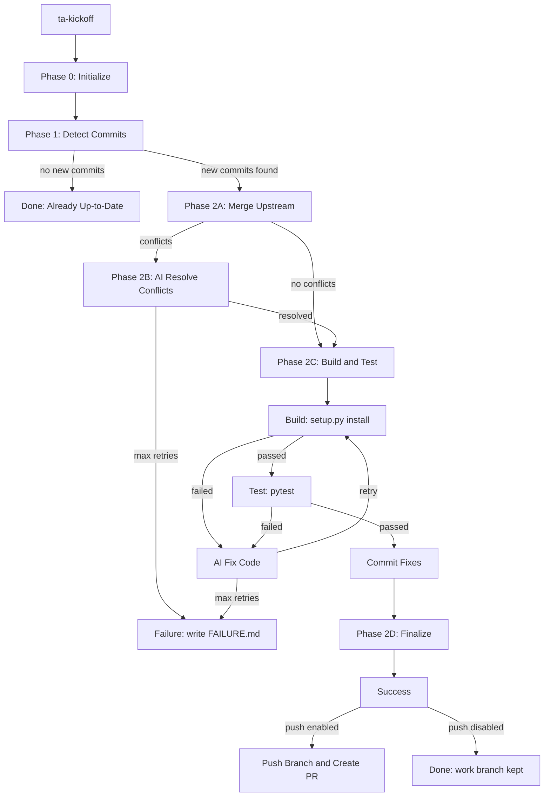

```mermaid
flowchart TD
    A["ta-kickoff"]
    A --> B["Phase 0: Initialize"]
    B --> C["Phase 1: Detect Commits"]
    C -->|no new commits| D["Done: Already Up-to-Date"]
    C -->|new commits found| E["Phase 2A: Merge Upstream"]
    E -->|conflicts| F["Phase 2B: AI Resolve Conflicts"]
    E -->|no conflicts| G["Phase 2C: Build and Test"]
    F -->|resolved| G
    F -->|max retries| H["Failure: write FAILURE.md"]
    G --> G1["Build: setup.py install"]
    G1 -->|failed| I["AI Fix Code"]
    G1 -->|passed| G2["Test: pytest"]
    G2 -->|failed| I
    G2 -->|passed| J["Commit Fixes"]
    I -->|retry| G1
    I -->|max retries| H
    J --> K["Phase 2D: Finalize"]
    K --> L["Success"]
    L -->|push enabled| M["Push Branch and Create PR"]
    L -->|push disabled| N["Done: work branch kept"]
```