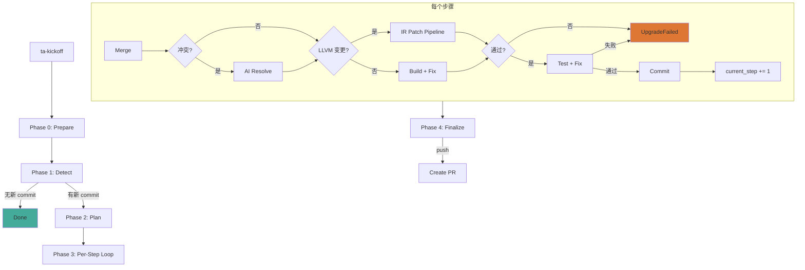
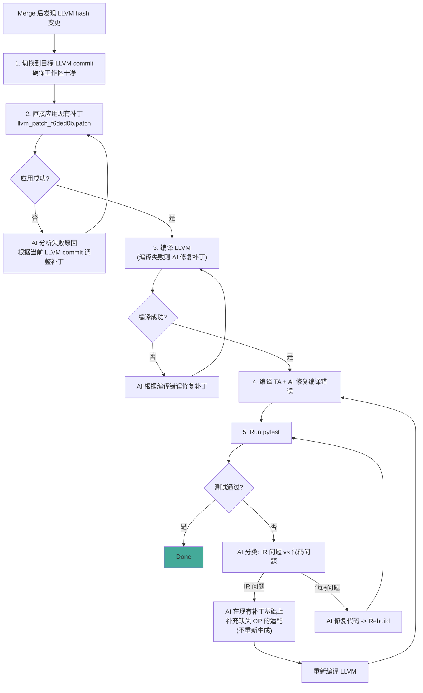

# 单步模式工作流



## IR Patch Pipeline（LLVM hash 变更时）



## 关键变化（vs 旧流程）

| 旧流程 | 新流程 |
|--------|--------|
| 先做 OP 分析 + 变更分析 | 直接应用现有补丁 |
| AI 从零生成补丁 | AI 在现有补丁上调整/补充 |
| 分析阶段在补丁之前 | 分析阶段在测试发现问题后 |
| 每次重新生成完整补丁 | 保留已有内容，只补充缺失 OP |

## 修复代码评价机制

```
AI 修复
  |
Layer 1: AI 自检 (prompt.md step 6)
  |-- 检查文件路径 -> 不在允许目录则自行回退
  |
Layer 2: 代码校验 (validate_fix)
  |-- 硬检查 -> 不通过则 git revert + 反馈 + 不消耗 attempt
  |
Layer 3: 实际验证
  |-- 编译/测试结果 -> 失败则继续 fix loop
```

详见 [fix-validation-flow.md](fix-validation-flow.md)
